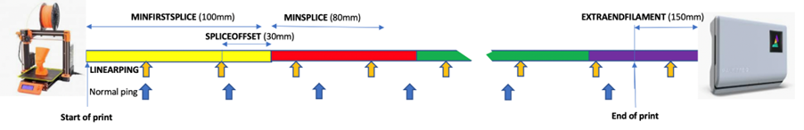
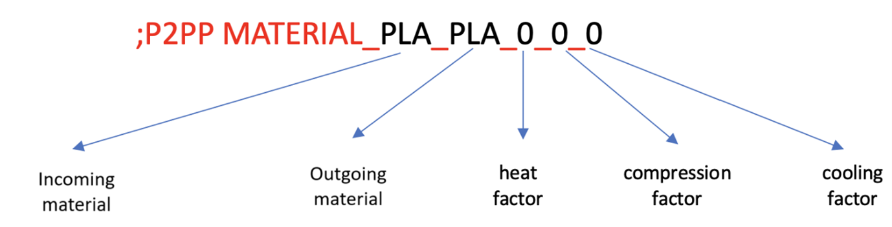
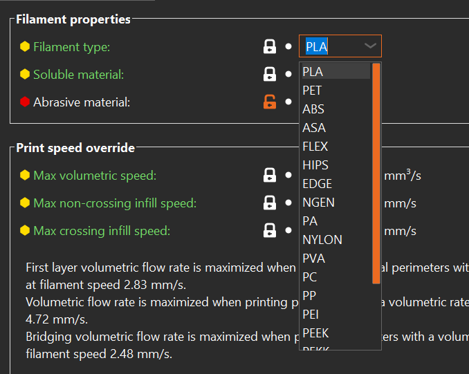
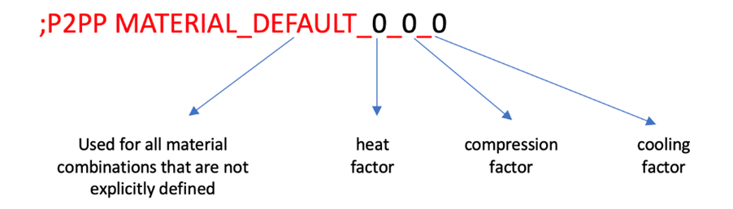
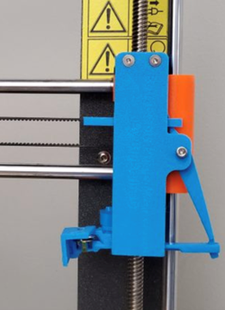
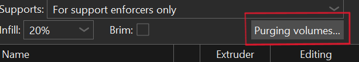
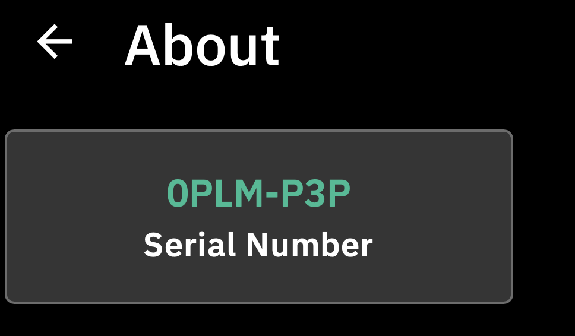
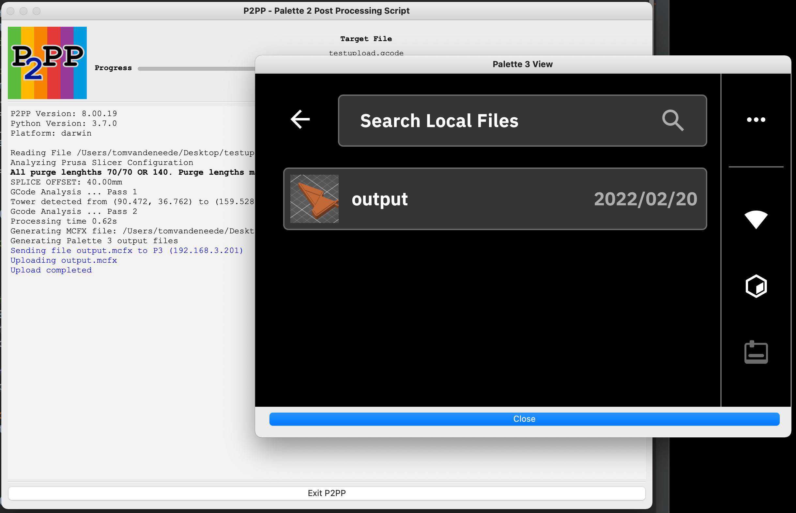
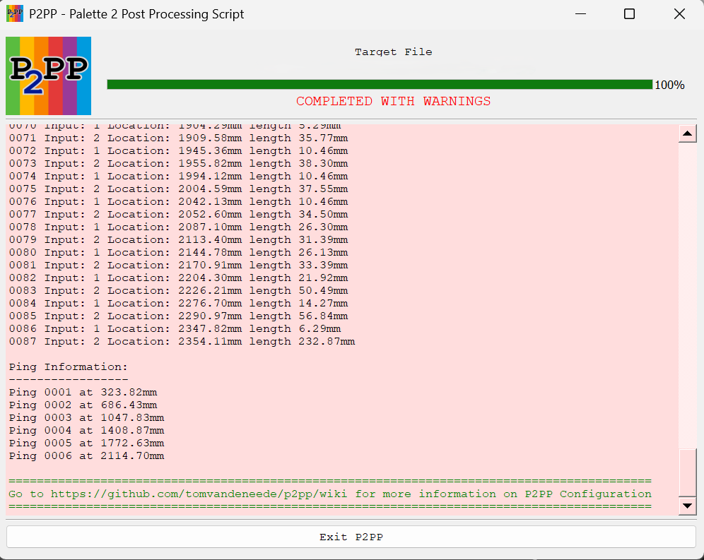

# P2PP Configuration

!!! important

    All settings will be prefixed by `;P2PP` followed by a parameter name and a setting.  
    All P2PP configurations are considered CaSe SeNsItIvE!!! 


A brief overview of all parameters is available in [P2PP Parameter Overview](p2pp_param_overview.md).


## Palette device definition


This tells P2PP what kind of palette device you have.  
Add one of the following lines corresponding to your device at the very beginning of your startup gcode 
configuration BEFORE ANY OTHER P2PP instruction:  

- Palette 2:  

        Nothing


- Palette +:  

        Nothing

- Palette 3: 

        ;P2PP PALETTE3

- Palette 3 Pro: 

        ;P2PP PALETTE3_PRO


## Printer Profile


The printer profile is the unique ID that is linked to a calibration set in your Palette device. It will determine the loading length, palette specific calibration as well as the long-term historic learning factor associated to your printer/palette combination. You can make up your own 32-digit hex decimal value for the palette 3 (Pro) or a 16-digit hex decimal value for the palette 2.  

If you are currently using Canvas or Chroma and you want to keep on using the same calibration information you can [copy the information from an existing `.mcf.gcode` file]() TODO.  

In the start g-code, you should get exactly 1 line with a printer profile configuration. You can choose not to add a printer profile and use the P2PP default BUT you will receive a warning (that can be ignored).

- Palette 2: 

        ;P2PP PRINTERPROFILE=e827315ff39d9c78

- Palette 3 (Pro): 

        ;P2PP PRINTERPROFILE=12345678901234567890123456789012


## Splice Configuration





### Splice Offset

Splice offset defines the amount of extra filament that is added to the first splice. It will force the color swap further into the purge. As a result, when a color change occurs, the printer will still continue to print in the old color for the amount defined in the splice offset parameter. This gives the print a small buffer in case more filament was consumed than foreseen.  

Making the offset too small may result in early transition. On the other hand but printing in the old color during the purge sequence, you remove that amount from the overall purge so if you make spliceoffset too large you will end up having color bleeding or late color transitions. 34-40 seems to be a good value, but in some cases a higher value may be required. The value is specified in millimeter.


    ;P2PP SPLICEOFFSET=40  


### Minimum Splice Lengths


The minimum length of splices that can be generated by a Palette device. There are 2 types; the minimum length of the first splice and the minimum lengths of the consecutive splices. These values can be brought down slightly at your own risk. It is good practice to leave them to the default values.  

- Palette 2: 

        ;P2PP MINSTARTSPLICE=100  
        ;P2PP MINSPLICE=80

- Palette 3 (Pro):

        ;P2PP MINSTARTSPLICE=130  
        ;P2PP MINSPLICE=90


### Extra filament at the end of the print


Depending on the setup of your printer you may need to add an extra length of filament to make sure the filament is driven by the filament motor until the very end of the print.  

On a direct drive a value of 100 to 150mm should probably be sufficient, on Bowden printers where the extruder motor is further away from the extruder, longer lengths are needed. This parameter is specified in millimeter.


    ;P2PP EXTRAENDFILAMENT=150


### Linear Ping setting (OPTIONAL)


- Normal Ping: Distance between the pings increases throughout the print. Each next ping distance is approx. 3% longer than the previous. The first ping occurs after 350mm of printing. this can result in less strict filament consumption in later stages of the print.  
Each ping is represented by a blue downward arrow in the diagram below.

- Lineair Ping: Distance between the pings stays constant througout the entire print. The distance between pings can be defined by the user. The parameter should be specified in millimeters. The default distance is 350mm.  
Each ping is represented by a yellow upward arrow in the diagram below.


    ;P2PP LINEARPINGLENGTH=350


!!! note

    If you want a ping lengths below 300 mm, enable the power chaos mode:  

        ;P2PP POWERCHAOS


## Adjusting the purge speed (OPTIONAL)


You can adjust the speed of the purge tower with a multiplier ranging between 10% and 500% [0.1 - 5.0].

    ;P2PP PURGESPEEDADJUST=1.0


## Limiting the purge speed (OPTIONAL)


If you are using the PrusaSlicer generated tower code in unprocessed mode or in tower delta mode you may find the purge tower is printed too fast. You can prevent this add the `PURGETOPSPEED` (in mm/min) to limit the speed at which purge is printed.


    ;P2PP PURGETOPSPEED=3600


## Splicing Algorithms

One of the most important settings is the definition of how splices should be generated.  
Splices are defined by 3 numbers:  

- Heating 

- Compression 

- Cooling 

A default splice has 3 numbers you can tune the settings for your material. The numbers can be obtained using the standard splicing tuning process as defined by 
Mosaic Mfg. They represent the heating, compressing and cooling factor.  

It is good practice to put all of your splicing algorithms into the `start g-code`.  
This will prevent surprises when mixing materials later on.


P2PP supports 2 ways to define your splices:




The first way is to describe the heat/compression/cooling factor for a splice between two materials. The name of the material (in this case `PLA`) is taken from the filament type defined in the filament descriptors within PrusaSlicer: 





It is possible to define a default splice setting just in case no appropriate splice setting is defined.  





This sets the default splice values in case no splicing algorithm is defined for 2 materials used in the print. P2PP will default to this process any time materials are 
fused that have no specific splice definition. In some cases the same material could require slightly different settings. In that case you can apply a filament override.  

This is done by adding the following line to the `filament custom start g-code`. Add a line as follows (in this case we define a new filament name `PLA2`)


    ;P2PP FILAMENTOVERRIDE=PLA2


This will tell P2PP to use `PLA2` instead of the standard material taken from 
PrusaSlicer. You can then refer to `PLA2` in your splicing algorithms.  
Eg.:  

    ;P2PP MATERIAL_PLA_PLA_0_0_0  
    ;P2PP MATERIAL_PLA_PLA2_-1_0_0  
    ;P2PP MATERIAL_PLA2_PLA_0_0_0  


If you want more tips for splice tuning, go to [troubleshooting splice tuning]() TODO.


## Special Features


Feature Compatibility Matrix:  

|                        |      Tower Delta      |      Full Purge Reduction      |      Side Wipe      |      Side Wipe Big Brain      |
|:-----------------------|:---------------------:|:------------------------------:|:-------------------:|:-----------------------------:|
|  Absolute Extrusion    | :material-check:      | :material-check:               | :material-check:    | :material-check:              |
|  Tower Delta           | :material-check:      | Full Purge Reduction           | Side Wipe           | Side Wipe Big Brain           |
|  Full Purge Reduction  | Full Purge Reduction  | :material-check:               | Side Wipe           | Side Wipe Big Brain           |
|  Side Wipe             | :material-close:      | Side Wipe                      | :material-check:    | Side Wipe Big Brain           |
|  Side Wipe Big Brain   | :material-close:      | Side Wipe Big Brain            | Side Wipe Big Brain | :material-check:              |
|  Skirt                 | :material-check:      | :material-check:               | :material-close:    | :material-close:              |
|  Auto Add Purge        | :material-close:      | :material-check:               | :material-check:    | :material-check:              |
|  Temperature Control   | :material-check:      | -                              | -                   | -                             |

### Absolute Extrusion (OPTIONAL)


During the gcode generation process in PrusaSlicer, only relative extrusion code is supported. That means that each extrusion command in the file is specifying the 
length relative to the current position of the extruder. 

The downside is that rounding error accumulate over time and this may have a negative effect on the filament consumption in long prints. By converting the file to absolute extrusions, the error is still there, but to a lesser extent and it also takes the pings into account so they will be part of the Palettes correction mechanism.  

To enable the extra cycle at the end of the processing to convert the extrusion lengths, add the following line to your start g-code:  


    ;P2PP ABSOLUTEEXTRUDER


### Side Wiping (OPTIONAL)


!!! note

    Starting with **PrusaSlicer 2.9.0**, the Side Wipe feature is no longer supported. This is because the **wipe tower can no longer be positioned outside the printable bed area**, which was essential for side wiping to function properly.  


Side wiping is a mechanism that fully replaces the purge tower with extrusions that happen off-bed and that will not make part of any physically printed structure. Depending on the method used, you will either get an extrusion spaghetti or small blobs of plastic.  
The advantage of side wipe is that no purge structure needs to be maintained, so you just purge the exact amount you need, no more no less.  

The downside is that you will end up with “non-structured” plastic blobs or spaghetti. When doing this, make sure you have something that catches this purge so it cannot make it to your actual print. It could easily turn your extruder in a great mass of plastic.  
In order to enable side wipe you need to move the purge block fully off the build plate.


#### Bed Side Purge (OPTIONAL)


This is the first way of doing side purge. It will move the carriage to the side of the bed and extrude spaghetti of the side of the bed while moving back and forward on 
the Y-Axis. In order to setup this form of side wipe you will need to:  

- Setup the X-Position to which the printer should move.  

- Define the minimum and maximum Y-coordinates which the printer will move between.  

- Since there is no backpressure on the extruder, `SIDEWIPECORRECTION` allows for a correction of the amount of purge material made during this form of side 
wipe correction.  


```
;P2PP SIDEWIPELOC=X254  
;P2PP SIDEWIPEMINY=45  
;P2PP SIDEWIPEMAXY=195  
;P2PP SIDEWIPECORRECTION=1.0  
```

#### Stationary Side Wipe (OPTIONAL)

!!! note

    This works starting from **P2PP v5.2.0**.

Stationary side wipe is similar to regular sidewipe, but if does not move the Y-axis in the process. It is achieved by setting both `SIDEWIPEMINY` and 
`SIDEWIPEMAXY` to the same value. The X-location is determined by the `SIDEWIPELOC` parameter.  

The `WIPEFEEDRATE` parameter will determine the speed of extrusion. Recommended value for the `WIPEFEEDRATE` parameter is 200. You can try higher values, but increase in speed can result in loss of steps on the extruder stepper motor if the hotend is unable to keep up. This will impact your pings!


    ;P2PP SIDEWIPELOC=X254  
    ;P2PP SIDEWIPEMINY=45  
    ;set SIDEWIPEMAXY to the same value as SIDEWIPEMINY  
    ;P2PP SIDEWIPEMAXY=45  
    ;set WIPEFEEDRATE is required to override default value!!  
    ;P2PP WIPEFEEDRATE=200  


#### Big Brian 3D Purge Mechanism (OPTIONAL)


A second way of doing purge is collecting the purge in a Big Brain 3D mechanism.  





This device is currently only available for the Prusa MK3/MK3S printers and will require a stock extruder and x-idler. Step-files are available when you purchase the device so you can try to adapt to your own printer.  

The device comes with its own calibration guide. You will have to take the values from your calibration to complete the setup in P2PP.  

The following parameters need to be set to activate side wipe.  
Note that for side wipe to activate the purge block needs to be moved OUTSIDE of the heated bed. The purge position needs to be taken from the calibration results for your printer. 


    ;P2PP BIGBRAIN3D_BLOBSIZE=40  
    ;P2PP BIGBRAIN3D_COOLINGTIME=20  
    ;P2PP BIGBRAIN3D_PURGEPOSITION=255  
    ;P2PP BIGBRAIN3D_MOTORPOWER_HIGH=450  
    ;P2PP BIGBRAIN3D_MOTORPOWER_NORMAL=300  
    ;P2PP BIGBRAIN3D_FAN_OFF_PAUSE=2000  
    ;P2PP BIGBRAIN3D_ENABLE  
    ;P2PP BIGBRAIN3D_PRIME_BLOBS=2  


The other parameters are taken from the manufacturer’s website.  

The `BLOBSIZE` of 40 is the default value and all BLOBS will be 40mm of filament equivalent in size. This means that all purging sequences are rounded to the nearest greater multiple of 40mm.  

`Cooling` is set to 20sec, but could be reduced depending on the material used and the 
environmental situation. The blob needs to be hard enough to be pushed out of the 
way by the flicker arm.  

The `motor power` settings are defaulted to the manufacturers suggestions as well. 
The `default High power` value is 450, if you see that the motor is unable to hold position and you see layer shifts in your print you may need to increase this setting or reduce the number of springs. Increasing the value will increase the temperature of the X-axis motor. Further active cooling may be required to prevent damage.  

The `BIGBRAIN3D_FAN_OFF_PAUSE` parameter defines the delay between turning off the fan and the extrusion. This allows the fan to be fully off when the blob creation 
starts. The value for this parameter is defined in milliseconds.  

The `BIGBRAIN3D_PRIME_BLOBS` parameter can be used in case of short first splices to increase the length artificially. Each blob represents the amount of filament stated in the `BLOBSIZE` parameter.  

`BIGBRAIN3D_NUMBER_OF_WHACKS` sets the number of times the extruder is kicking the arm in order to release the blob (default = 1).  

`BIDBRAIN3D_RETRACT` sets the retractions when going to and returning from the purge location. The default value of 3 might be too much for some extruders.  


##### Defining the number of blobs


!!! note

    This feature is supported in **P2PP version 8.0.6 and higher**.


In PrusaSlicer in the Purge volumes window you can define the number of blobs you want to purge instead of the volume in mm³. All numbers below 20 are recognized as 
number of blobs. Experience shows that 3 blobs are enough to purge for a color like red or blue. Light colors like white need 4 or 5 blobs to purge if there are strong colors in the mix.  

The `from` values define the number of blobs purged before the color change happens. This gives the Palette some space to adjust when the pings vary.  

The `to` values define the numbers of blobs purged after the color change. This is important to get the color mix out of the nozzle and a brilliant color on the 
printed object. The two numbers (`from` and `to`) are added together to get the number of blobs purged per color change.  


To save filament a good tip is to adjust the blob size in the start gcode. The minimum splice length is 90mm (Palette 3 (Pro)). The default blob size is 40mm. 
The following calculation is not 100% correct because the feedrate is set to 95% in most cases but it can explain the issue.  
So 90mm divided by 40mm is 2.25 blobs. That means 3 blobs are the minimum to purge and 0.75 blobs are wasted.  
You can decrease the blob size to get closer to the perfect purge amount but that also means that you have to increase the number of prime blobs, else you will get a short first splice error.


    ;P2PP BIGBRAIN3D_ENABLE  
    ;P2PP BIGBRAIN3D_BLOBSIZE=35  
    ;P2PP BIGBRAIN3D_COOLINGTIME=20  
    ;P2PP BIGBRAIN3D_PURGEPOSITION=251  
    ;P2PP BIGBRAIN3D_MOTORPOWER_HIGH=450  
    ;P2PP BIGBRAIN3D_MOTORPOWER_NORMAL=300  
    ;P2PP BIGBRAIN3D_PRIME_BLOBS=3 


### Tower Delta (OPTIONAL)


Tower delta is the principle of not printing empty tower sequences that take up time and filament. Instead the tower grows at a slower pace than the print. This creates 
a risk that the print head or the beam may hit the actual print while printing the purge.  

In order to minimize the risk it is good practice to group the printed objects in front of the purge and to one side of the bed and put the tower on the diagonal opposite (back side) of the print.  

!!! note

    PrusaSlicer has this feature built in as of **version 2.2**. The major difference between the PrusaSlicer implementation and the P2PP implementation is that in P2PP you can specify the maximum difference between the print and the tower to mitigate the risk of hitting the print.  


There is one parameter that is used for both activating and setting the maximum delta of a tower delta print:

    ;P2PP PURGETOWERDELTA=10  
    ;P2PP WIPEFEEDRATE=3000  


Adding this parameter allows for the tower to grow 10mm lower than the actual print. If you do not want to limit the difference, either put in a large number (999) or use the [`full purge reduction`](#full-purge-reduction-optional) feature described later.  
To disable the tower delta, put a value of 0.


!!! important

    Make sure you have the correct after layer gcode inserted as described above or the feature will NOT work correctly.  


The Tower delta function is useful on prints where you have lengths of print in a single color. (i.e. layers with no color change). These layers in general cause empty layers to be created in the purge tower which can easily be ignored.  

The `wipe feederate` specifies the maximum federate during wiping.  


### Full Purge Reduction (OPTIONAL)


Full Purge Tower reduction is similar to Tower Delta but:  

- Has no difference in the number of layers.

- Will generate a whole new purge tower. (will be used for other features in the 
future)


```
;P2PP FULLPURGEREDUCTION  
;P2PP WIPEFEEDRATE=3000  
;P2PP AUTOADDPURGE  
```

Full purge tower reduction will use the same amount of filament as [Side Wiping](#side-wiping-optional) but it will still create a physical purge tower that will need more time to create.  

The `wipe feederate` specifies the maximum federate during wiping.  

There is an experimental setting `AUTOADDPURGE` that automatically adds purge length in case a short splice is detected. This is only intended for occasional short splices, if there are many short splices in the print, the purge tower will grow over the print height. This will cause issues.  


## Accessory Mode (OPTIONAL)


!!! note

    - This feature is highly recommended when using Klipper.

    - When using accessory mode, it can help to change the output file extension appropriatly.


Accessory mode prints generate Ping sequences in a separate MAF/MSF file  that is put on an SD card and is fed to the Palette 2 in that way. The pings are inserted in 
the form of delays during the print. As such the print can be executed directly from SD card in the printer without the need of an Octoprint.  


- Palette 2: 

        ;P2PP ACCESSORYMODE_MAF  

- Palette 3 (Pro): 

        ;P2PP ACCESSORYMODE_MAFX  

- Palette +: In this mode, P2PP can be used in conjunction with the Palette+, by generating a MSF file that can be loaded on the SD Card, just as if it were generated by Chroma/Canvas. **It is important to note that the values below are not what you see on the Palette+ Screen, but are obtained from Chroma, after completing the calibration.**

        ;P2PP ACCESSORYMODE_MSF  
        ;P2PP P+PPM=<ppm value>  
        ;P2PP P+LOADINGOFFSET=<loading offset>  


## Temperature Control (OPTIONAL)


!!! note

    (Thanks to J. Giesser for the suggestion) **P2PP v4.12.0**.


```
;P2PP TEMPERATURECONTROL
```  

When set, this setting will change/alter the temperature settings in the output file. This can be useful when using filaments that require different processing temperatures. The temperature control feature will make sure all purges are handled at the highest temperature to prevent the hotter printing filament to clog on 
the heat-up or cooldown.  

When moving from high to low temperature, the printer will purge and will reduce the temperature AFTER all purging has completed.  

When moving from low to high, the printer will wait for the hot end to heat up over the tower prior to purging.  


!!! warning

    **Caution:** When using filament such as PVA, printing at the hottest setting may cause the filament to burn and cause very difficult to remove clogs. Use this feature with caution!


## Purge/Wipe Length

The quality of your color transitions will greatly depend on the purge or wipe length defined in PrusaSlicer.  
When in platter vies mode in a multicolor setup, you will notice a Purging Volumes button right above the object tree windows.





Clicking this button will bring up the purge volume adjustment dialog.  


!!! important

    The values in this diagram are defined in $mm^3$ (volume of filament), not in mm (length of filament). $70mm^3$ of 1.75 mm filament is about $\frac{70}{\pi\frac{1.75^2}{4}} \approx \frac{70}{2.4} mm$ of filament.  


The length of the purge will depend on the mature of the filament used. The effective length of purge generated is the sum of unload of the old value and the load value for the new filament.  

It is good practice to keep the minimal purge around 180mm so you avoid short 
splice specifically when using layers with only tiny details in a specific color.  


As a rule of thumb:  

- **Strong colors** (e.g. red/black) will need a low load / high unload values.  

- **Weak colors** (e.g. white transparent) will need high load / low unload values.  


So going from black to white will be unload black + load white = high value.  
The other way around form white to black, will add low unload + low load = low value.  

In modes where the tower is generated by P2PP, an extra amount of filament can be 
added automatically to meet the min splice length requirements for the Palette hardware. 
For compatibility of this function with other processing modes check the [matrix](#special-features) above.  

The feature is activated by adding the following line to your start gcode under printer settings:  


    ;P2PP AUTOADDPURGE


## Klipper Firmware


When running a printer based on the KLIPPER firmware, add the following line to detect the tool changes. Please don’t change the names of the extruders, just use 
the defaulted names.  


    ;P2PP KLIPPER_TOOLCHANGE


## Process Preheat for P3 (Pro) (OPTIONAL)


This allows the Palette 3 (Pro) to preheat the printer. This only works in coneccted mode.  


    ;P2PP P3_PROCESSPREHEAT


## Manual Swap (OPTIONAL)

!!! note
    
    Specially Added for Manmeet.


Pauses the print with M25 on toolchange. This is commonly not used/set


    ;P2PP MANUAL_SWAP


## Replace Finish moves to M400

This command Replaces `G4 P0` command to `M400`. This can be mandatory for some printer firmwares in order to clear there movement buffers and sychronize their motion to the pings of the Palette device.


    ;P2PP FINISH_MOVES_M400


## Non-Print related Settings


### Uploading files to P3 (Pro) (OPTIONAL)


!!! note
    
    As of **P2PP v8.0.28**.


Let's you upload the print file to the Palette 3 (Pro) after P2PP has processed the gcode.

#### Pre-requisites:

- Files cannot exceed `1GB` in size.  

- Enable `Local File Transfer` and `Local Web Client` in the P3 (Pro) menu.  
    


Add the following configuration items to your config specifying the IP-address where to send the file. The `P3_UPLOADFILE` command is the trigger for sending the file to the printer:  

!!! note

    Don't put the brackets around the hostname of the IP address. Also no need to include the port number.

```
;P2PP P3_HOSTNAME=[hostname or IP address of P3]
;P2PP P3_UPLOADFILE
```


The hostname of your device should be the serial number (or IP) of your Palette 3 (Pro) that can be found in the menu under `Settings - About`. On my system, I need to add `.local` to the serial number to actually find the device.  



So in my case the config looks like:

    ;Example config! DO NOT COPY... 
    ;P2PP P3_HOSTNAME=0PLM-P3P.local
    ;P2PP P3_UPLOADFILE


### Show P3 (Pro) interface (OPTIONAL)


This command will open a browser to the printer after successfully uploading the file so you can start the print if you like from your computer.  


    ;P2PP P3_SHOWPRINTERPAGE
    ;P2PP P3_ROTATEINTERFACE

The `P3_ROTATEINTERFACE` parameter only applies if you are operating the P3 (Pro) in a rotated screen configuration (upside down)  


After running P2PP with upload and webbrowser the screen should look as follows:  




### Change printer profile name of Palette 3 (Pro) (OPTIONAL)


This command allows you to change the name of the printer in your splice file. It has no functional benefit to change this parameter.  

    ;P2PP P3_PROFILENAME


### Save Unprocessed G-code (OPTIONAL)


!!! note

    As of **P2PP v4.13.0**.


Occasionally we will ask you to send us the unprocessed gcode for your project to replicate specific issues during the processing. Under normal circumstances the original code will be overwritten by the processed gcode to get most compatibility with the PrusaSlicer.  

In order to make the generation of the unprocessed file a little easier, a new config code was added to do just this: 


    ;P2PP SAVEUNPROCESSED


Setting this parameter will generate a new file during processing which has exactly the same name as the processed file but a suffix `_unprocessed` is added to the 
filename. So in case you generate a filename `test.mc.gcode`, the program will generate this file as well as a file named `test.mcf_unprocessed.gcode`. When needed you can send in this file.  


### Check Version (OPTIONAL)


Adding the `checkversion` keyword to your stag code will trigger P2PP to download the information about the latest master/dev online versions and warn you if updates are available.


    ;P2PP CHECKVERSION


### Console Wait (OPTIONAL)


Setting the `CONSOLEWAIT` parameter will trigger P2PP to wait for user response even if no warning were issued.


    ;P2PP CONSOLEWAIT


### Ignore Warnings (OPTIONAL)


Ignore warnings will close the window even if there were warnings during the processing.  


    ;P2PP IGNOREWARNINGS


### Debug T-Command (OPTIONAL)


!!! warning

    Files generated this way will NOT print correctly with the Palette devices.


Leave the T-commands untouched in the print so it can be previewed in g-code previewers while maintaining the information on the tools used.


    ;P2PP DEBUGTCOMMAND


## Running P2PP


Once you have all parameters entered you can load a multi-color file in PrusaSlicer and click the export button/send to printer button... If all goes well you will get a pop-up window from P2PP.  

If there were warnings (like in the example below), the window will remain open (as long as the window is open PrusaSlicer will not functionnormally and should not be used).  

You can review the errors and see what is needed to correct them. Clicking OK will 
return you to PrusaSlicer. If uploading was selected, the print will be uploaded to the printer. 





If the processing went through without issue the window will close automatically without waiting and the PrusaSlicer will take control from there. If you have the consolewait parameter set you will get a similar window with a header confirming the correct processing.


In either case the output file will contain the processed information from P2PP, even if errors have been detected.  

