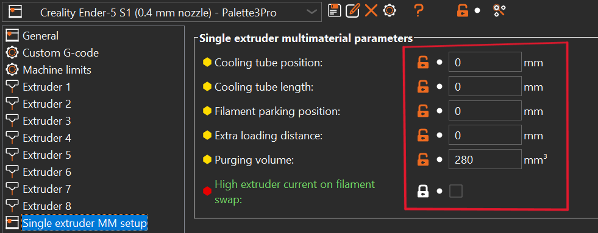
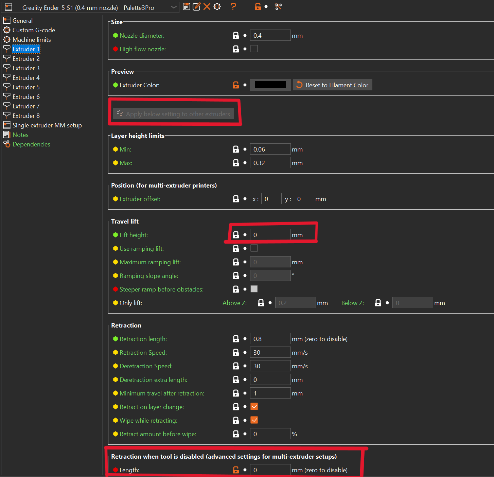
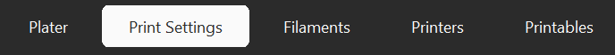
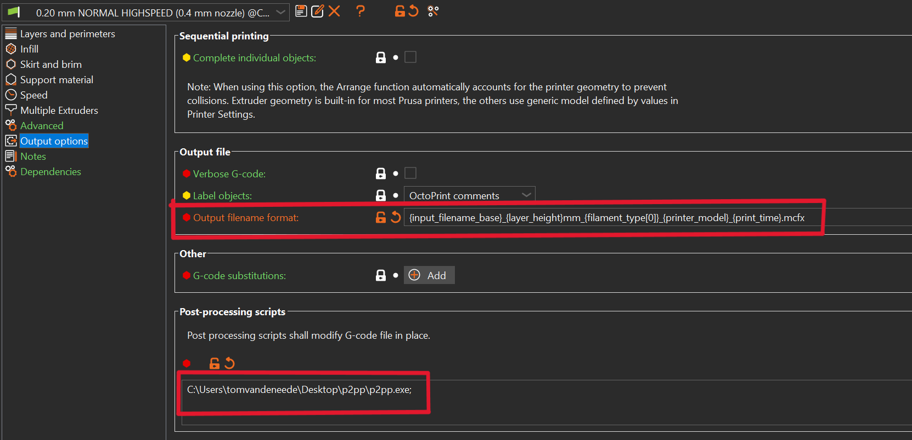
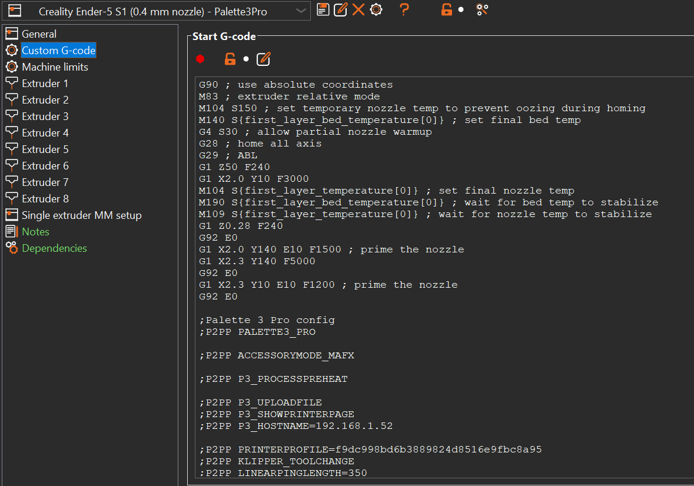

# PrusaSlicer Configuration


## Put PrusaSlicer in EXPERT mode

There should be a dropdown menu with 3 options: Simple/Advanced/Expert in the top right corner of 
the PrusaSlicer window. Click on the `Expert` option and confirm that it is highlighted 
like shown in the picture below:  


## Define the number of extruders


!!! note

    You may have to repeat this for different profiles


Set the number of extruders to 4 (or 8) / enable `Single Extruder Multi Material`:


Set all parameters under `Single extruder MM setup` to zero except `Purging volume` (optional, can be used as default value for [transitions](p2pp_config.md#purgewipe-length)):



### Extruder 1/2/3/4 (/5/6/7/8) settings:

Make sure the settings of each of the 4/8 extruders are set correctly. Set the `Lift Height` to 0.  

Settings for `retraction when the tool is disabled` are not used.   
You can also set the extruder color here. This is the color that will be shown on the 
Palette screen during the loading process. The color can also be set from the plater 
interface.


!!! tip

    Use the `Apply below settings to other extruders` button when you are done configuring 1 extruder.





## Thumbnail Setup

The Palette 3 (Pro) is capable of showing a thumbnail picture on the display. The thumbnail can be automatically generated by Prusa Slicer but the feature needs to be configured.


The the size of the image (`width x height / format`) in the format shown in the G-Code thumbnails. P2PP will extract ONLY the first thumbnail and will use that to generate the preview image.  

Here is the correct format ready to copy:  

```
640x480/PNG
```


## Tower Setup





Keep the wipe tower rotation angle set to 0 for proper operation (do not rotate it on buildplate). The location can be set later by dragging the tower on the platter.
Ooze prevention does NOT apply because we use a single extruder only.


!!! note

    As of **PrusaSlicer 2.9.0**, the {wipe_tower_x} (and y) placeholders are no longer automatically embedded in the G-code.  
    To ensure the wipe tower position is available for downstream processing, **you must explicitly add the following in your `End G-code`:**

        ; EXTRA_CONFIG_VARIABLES  
        ; wipe_tower_x = {wipe_tower_x}  
        ; wipe_tower_y = {wipe_tower_y}


## Filament Setup


This step should be repeated for EVERY filament type you want to use with your Palette device.  
First step is to set all ramming parameters to 0 as well as almost all of the tool change and wipe tower related settings under the advances tab of your filament.  

Note the filament type (here PLA) listed in the dropdown box. This is the reference to the filament that will [later](p2pp_config.md#splicing-algorithms) be used when creating splicing algorithms to tell Palette device how much heat/compression/cooling will be required to splice this filament together to other types of filament.  


## Layer Configuration


For some of the features P2PP will need to know which features are linked to a particular layer.  
Therefore a very specific layer setup is required to make sure this information is captured correctly.  
Make sure that the following code appears in the `After layer change G-Code` (copy 
this literally)  

!!! note

    As of **P2PP v4.0.4** the extra `LAYERHEIGHT` is required


```
;AFTER_LAYER_CHANGE 
;LAYER [layer_num]  
;LAYERHEIGHT [layer_z]
```


## Script Configuration


Next thing to do is to configure the P2PP script in PrusaSlicer.





You have to specify 2 pieces of information here:  

- **File name template.** You can use the current template but it may be interesting to add the `.mcfx` instead of gcode.  
    This has no functional purpose but it will help you discriminate between P2 and non-P2 prints in the canvas hub overview.  


- **In the post processing script tab you will need to copy the full path of the script.**  
    This information (bold red line) you got at the very beginning when first launching P2PP.


## Printer Configuration


All basic configuration goes into the `Printer Settings → Custom G-Code → Start G-Code`.  
You can group all P2PP config settings at the end of your normal start g-code.  

!!! important

    All settings will be prefixed by `;P2PP` followed by a parameter name and a setting.  
    All P2PP configurations are considered CaSe SeNsItIvE!!! 





All P2PP configuration options are documented in [P2PP Configuration](p2pp_config.md)